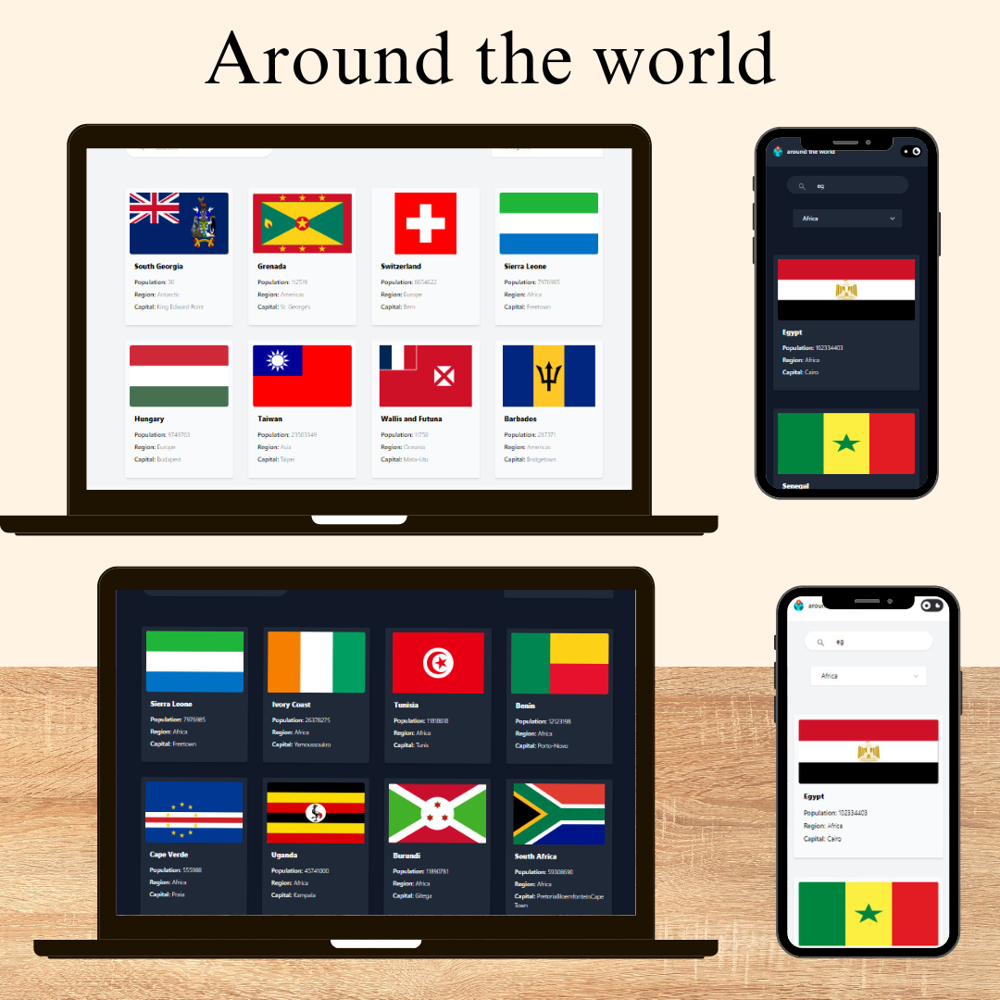

# Around-The-World 🌍  

## Live Demo  
  
---

## Introduction  
**Around-The-World** is a responsive web application built using React.js and Tailwind CSS. It fetches data from the **REST Countries API** to display comprehensive information about countries worldwide. The app offers a sleek design, supports light and dark themes, and is optimized for all device types.

---

## Features  
- **Country Search:** Search and filter countries dynamically based on user input.  
- **Country Details:** View detailed information about each country, including population, region, capital, and more.  
- **Light and Dark Themes:** Toggle between light and dark modes for a personalized user experience.  
- **Responsive Design:** Adapts seamlessly to all screen sizes, from desktops to mobiles.  

---

## Technologies  
- **React.js:** For building interactive UI components.  
- **Tailwind CSS:** For modern and responsive styling.  
- **REST Countries API:** For fetching real-time data about countries.  
- **JavaScript (ES6):** For dynamic data manipulation and interactions.  

---

## Technical Details  

### API Integration  
The app uses the **REST Countries API** to fetch data dynamically. Example endpoint:  
[https://restcountries.com/v3.1/all](https://restcountries.com/v3.1/all)

### Theme Toggle  
- React state management is used to handle light/dark theme toggling.  
- Tailwind CSS's utility classes ensure seamless styling changes for both themes.  

### Responsive Layout  
- Tailwind CSS grid and flexbox utilities ensure proper alignment and scaling across devices.  
- The layout dynamically adjusts based on screen size, providing an optimal viewing experience on desktop, tablet, and mobile.  

### Error Handling  
- Integrated error handling for API calls using try-catch blocks to ensure the app gracefully handles cases when data cannot be fetched or loaded.  
- Displayed error messages to inform users when something goes wrong.

## Usage

### Adding a Country
- The app automatically fetches and displays all countries with detailed information.
- Use the search bar to quickly find a specific country.

### Toggling the Theme
- Click the "Theme Toggle" button to switch between light and dark modes.

### Mobile and Tablet Compatibility
- The app is fully responsive and adjusts its layout for mobile and tablet views using Tailwind CSS.
